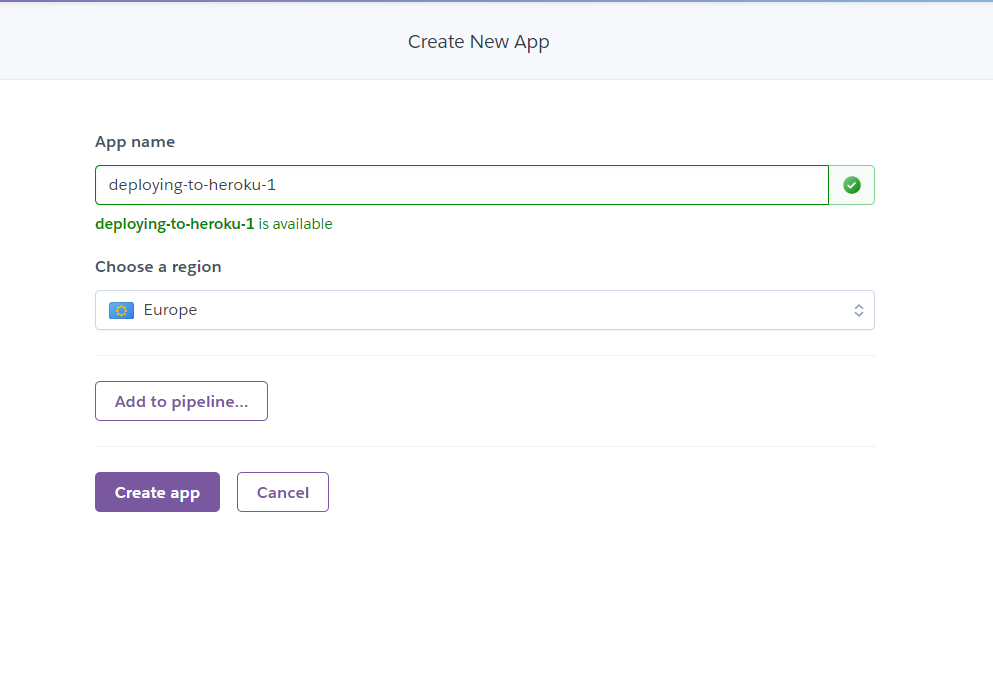
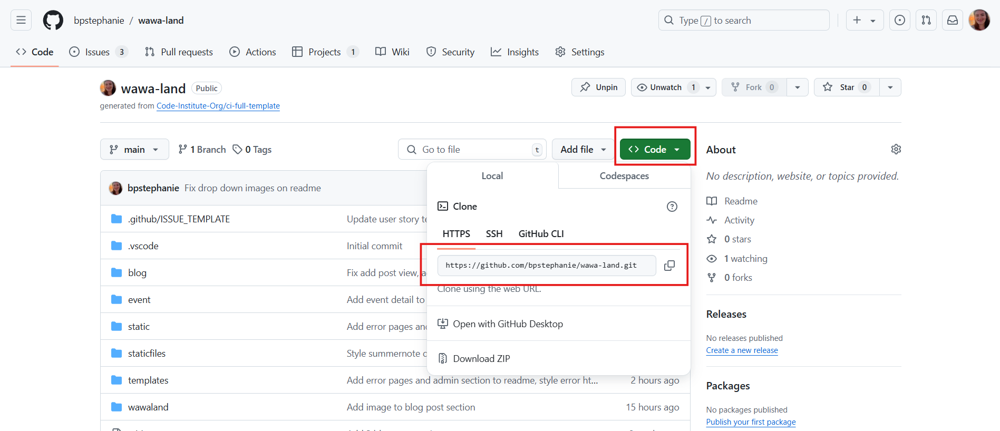

# BookNook

BookNook is your one-stop destiantion for all things literary. Our platform not only offers a wide range of book and book-related products, but also fosters a vibrant community through our interactive forum. Whether you're looking to purchase the latest bestseller or connect with fellow book enthusiasts, BookNook has you covered. Engage with other like-minded individuals in a space that's comforting.

Welsome to <a href="https://bn-booknook-017930c30e2f.herokuapp.com/">BookNook</a>

## Contents
* [**BookNook**](<#booknook>)
* [**Contents**](<#contents>)
* [**Project**](<#project>)
  * [Objectives](<#objectives>)
  * [Customer Goals](<#customer-goals>)
  * [Business Goal](<#business-goal>)
  * [Business Model](<#business-model>)
    * [Social Media Pages](<#social-media-pages>)
      * [Facebook](<#facebook>)
      * [Instagram](<#instagram>)
  * [Marketing Techniques](<#marketing-techniques>)
  * [Project Managment](<#project-management>)
    * [Github Kanban Board](<#github-kanban-board>)
    * [MoSCoW Prioritization](<#moscow-prioritization>)
    * [Epics](<#epics>)
  * [Database Schema (ERD)](<#database-schema>)
* [**User Experience UX/UI**](<#user-experience-ux/ui>)
  * [User Stories](<#user-stories>)
  * [Design Choices](<#design-choices>)
    * [Typography](<#typography>)
    * [Colour Scheme](<#colour-scheme>)
    * [Wireframes](<#wireframes>)
  * [Site Structure](<#site-structure>)
* [**Features**](<#features>)
  * [Existing Features](<#existing-features>)
    * [Navbar](<#navbar>)
      * [Logged in User](<#logged-in-user>)
    * [Small Screen Main Menu](<#small-screen-main-menu>)
      * [Logged in User](<#logged-in-user>)
    * [Home Page](<#home-page>)
    * [Products Pages](<#products-pages>)
      * [All Products Page](<#all-product-page>)
      * [By Genre/By Category](<#by-genre/-by-category>)
    * [Product Detail](<#product-detail>)
    * [Bag](<#bag>)
      * [Saved For Later](<#saved-for-later>)
    * [Checkout](<#checkout>)
    * [Order Processing](<#order-processing>)
    * [Checkout Success](<#checkout-success>)
    * [Order Email Confirmation](<#order-email-confirmation>)
    * [Webhook Success](<#webhook-success>)
    * [Profile](<#profile>)
      * [Delivery Details](<#delivery-details>)
      * [Personal Info](<#personal-info>)
      * [Order History](<#order-history>)
        * [Order Confirmation](<#order-confirmation>)
      * [My Reviews](<#my-reviews>)
      * [My Wishlists](<#my-wishlists>)
      * [Forum Interaction](<#forum-interaction>)
      * [Rewards and Benefits](<#rewards-and-benefits>)
      * [Downloads](<#downloads>)
    * [Community](<#community>)
      * [Forum](<#forum>)
      * [Post List](<#post-list>)
    * [BookNook Management](<#booknook-management>)
      * [Product Management](<#product-management>)
      * [Forum Management](<#forum-management>)
    * [Contact Form](<#contact-form>)
    * [Login](<#login>)
    * [Signup](<#signup>)
    * [Logout](<#logout>)
    * [Password Reset](<#password-reset>)
    * [Password Reset Done](<#password-reset-done>)
    * [FAQs](<#faqs>)
    * [Privacy Policy](<#privacy-policy>)
    * [Terms and Conditions](<#terms-and-conditions>)
    * [Newsletter Signup](<#newsletter-signup>)
    * [Footer](<#footer>)
    * [Error Pages](<#error-pages>)
      * [403](<#403>)
      * [404](<#404>)
      * [500](<#500>)
    * [CRUD Functionality](<#crud-functionality>)
  * [**Future Features**](<#future-features>)
* [**Technologies Used**](<#technologies-used>)
  * [Languages](<#languages>)
  * [Frameworks and Software](<#frameworks-and-software>)
  * [Python Packages](<#python-packages>)
* [**Testing**](<#testing>)
* [**Deployment**](<#deployment>)
  * [**Amazon Web Services**](<#amazon-web-services>)
    * [**S3 Bucket**](<#s3-bucket>)
    * [**IAM**](<#iam>)
    * [**Final AWS Setup**](<#final-aws-setup>)
  * [**Stripe API**](<#stripe-api>) 
  * [**To Deploy on Heroku**](<#to-deploy-on-heroku>)
  * [**To Deploy Locally on GitHub**](<#to-deploy-locally-on-github>)
  * [**To Fork the Project**](<#to-fork-the-project>)
  * [**To Clone the Project**](<#to-clone-the-project>) 
* [**Credits**](<#credits>)
  * [**Content**](<#content>)
* [**Acknowledgements**](<#acknowledgements>)

# Project
## Business Plan

  ### Social Pages
  - ### Facebook

  

Facebook Profile Photo and Cover Photo

  
  

  

  

Facebook Profile Photo and Cover Photo

  
  

  

  
  
  - ### Instagram

# User Experience UX/UI
  ## User Stories
  ## Design Choices
  - ### Typography
    - Google fonts were used for BookNook.
    - Lora was used because it combines readability with elegance, which I believe is perfect for a literary-focuded platform. The serif style provides a classic design which resonates well with book lovers.

    

    - Source Sans 3 was used for the forum because it offers a clean, modern look that enhanced readability and encourages user engagement. It's well suited for various screen sizes and different resolutions.

    

    - Roboto was used for a consistent and professional look across all pages. It's readbility makes it ideal for a wide range of content.

    

    [Back To Top](<#contents>)

  - ### Colour Scheme
  - ### Wireframes
  ## Site Structure

  The BookNook site structure is very straightforward and easy to understand.
  
  On larger screens and up the navbar at the top  has links to product pages, which have sorting and filtering features links. Users can access the forum, partners and about us pages in the community section. The logo always directs users back to the homepage. Users can access their profile from the account button and when signed in, a  logout link and wishlist link, when signed out, login and register links are present. If a staff member is signed in, a link to the product management page is present. To the right is the button to the shopping bag. In the center is a large search bar. 
  
  On small and medium screens there is a slide out menu, on this menu, users can find login and register links if not signed in and logout profile and wishlist links if signed in. There is the search bar, products, forum, partners, contact us and about us links. On the navbar, links to the homepage and bag are present at all times. If a staff member is signed in, they can access the product management page from the slide out menu.

  A footer is present at the bottom at all times, which has links to, about us, contact us and frequently asked questions in the shopping with us section. Social media links are present in the follow us section. And the privacy policy is present in the legal section.

  In the forum section, users can see all threads on one page by clicking on the category buttons to the left. By clicking on a thread title, users are redirected to the thread page where they can click the 'Back to Forum' button to go back without using back buttons.

  All users' accessible content is on the profile page, users can click on the buttons to the left to see their delivery details, personal info(bio), order history, reviews, wishlists, saved items, forum interaction, rewards and benefits, and see whether or not they are signed up to the newsletter. In all profiles sections, where content refers to threads, posts, products etc, links are everywhere for users to navigate to those pages.

  On the product management page, staff can add either a book or an accessory by choosing which form they see from the buttons on the left. 

# Deployment
  ## Amazon Web Services
  - ### S3 Bucket
  - ### IAM
  - ### Final AWS Setup
  ## Stripe API
  ## To Deploy on Heroku
  The site was developed using [VS Code](https://code.visualstudio.com/). All commit messages were pushed to [Github](https://github.com/) using the VS Code terminal. The finished project was deployed in [Heroku](https://dashboard.heroku.com/).

  Before starting the process on [Heroku](https://dashboard.heroku.com/), you first need to enter 'pip freeze > requirements.txt' in the terminal in your IDE. This adds a list of dependencies to your requirements.txt file needed for deployment. Commit these changes and push to GitHub before you deploy.

  You can also update your 'requirements.txt' file once you have already deployed to Heroku, by entering 'pip freeze > requirements.txt'. Don't forget to commit your changes and push to GitHub.

  The process of deploying to [Heroku](https://dashboard.heroku.com/) is as follows:

  1. Login to [Heroku](https://dashboard.heroku.com/) (or create an account).

  

Heroku Step 1

  
  

  

  
  2. In the top right hand corner there is a button 'New' that releases a dropdown menu, where you need to click 'Create a new  app'.

  

Heroku Step 2

  
  

  

  
  3. On the next page, you will need to add a name for your app and input what region you are in. Bear in mind that each app name is unique therefore you may need to try some different options out. Once you have decided on an app name and selected which region you are in. Click 'Create app'

  

Heroku Step 3

  
  

  

  
  4. On the next page, click the 'Settings' tab. Once you have clicked on the settings tab, click 'Reveal Config Vars' in the 'Config Vars' section. Next you will need to add values:

  | **Key**                  | **Value**                                      |
  |--------------------------|------------------------------------------------|
  | AWS_ACCESS_KEY_ID        | Insert your AWS access key ID here             |
  | AWS_SECRET_ACCESS_KEY    | Insert your AWS secret access key ID here      |
  | DATABASE_URL             | Insert your PostgreSQL database URL here       |
  | EMAIL_HOST_PASSWORD      | Insert your Email host password here           |
  | EMAIL_HOST_USER          | Insert your Email host username here           |
  | SECRET_KEY               | Any random secret key                          |
  | STRIPE_PUBLIC_KEY        | Insert your Stripe public key here             |
  | STRIPE_SECRET_KEY        | Insert your Stripe secret key here             |
  | STRIPE_WH_SECRET         | Insert your Stripe webhook secret here         |
  | USE_AWS                  | Set to True                                    |
  | DISABLE_COLLECTSTATIC    | 1 (temporary; can be removed for final deployment) |

  

Heroku Step 4 - Settings Tab

  
  

  

  

Heroku Step 4 - Config Vars Section

  

  

  
  5. In your IDE terminal, you need to type the following code to install the project requirements:

  - pip install gunicorn~=20.1
  - pip install -r requirements.txt
  - pip freeze --local > requirements.txt
  
  6. Next, create an env.py file at the root level directory, which must contain the following:

    - import os
    - 
    - os.environ.setdefault("DATABASE_URL", "CI database URL")
    - os.environ.setdefault("SECRET_KEY", " Your secret key")
  
  7. Next, create a file at the root level directory called Procfile. In this file enter:
    -  web: gunicorn my_project.wsgi
    - Replace my_project with your Django app name.

  8. Next, in your settings.py file, set DEBUG = 'DEVELOPMENT' in os.environ

  By doing this Debug will bet set to false in Heroku deployed site as there is no environment variable by that name but Debug is set to true whilst developing the project.

    **YOU SHOULD ALWAYS SET DEBUG TO FALSE BEFORE DEPLOYING FOR SECURITY**
  
  9. Add ",'your-deployed-url' " (without the double quotes) to the ALLOWED_HOSTS list in settings.py.

  10. Next, add commit and push your code to [Github](https://github.com/).

  11. Next, on [Heroku](https://dashboard.heroku.com/), you need to go to the 'Deploy' tab. For 'Deployment Method', click 'GitHub'. Search for the repository name you want to deploy and then click connect.

  

Heroku Step 11 - Deploy Tab

  
  

  

  

Heroku Step 11 - Connect to GitHub

    This sample repository has already been connected to Heroku so mine will look a little different from yours. However, where you can see 'App Connected to GitHub' on the image, you will see 'Connect to GitHub, next to that you'll be able to search for the repository you want to connect.

  

  

  12. Scroll down to the sections below, called 'Automatic Deploys' and 'Manual Deploy'. Here you need to choose which option best suits your project. Once selected, click 'Deploy Branch'.

      

Heroku Step 12 - Deploy

      
      

      

  
  The live link can be found here - <a href="https://bn-booknook-017930c30e2f.herokuapp.com/">BookNook</a>

  [Back To Top](<#contents>)

  ## To Deploy Locally on Github
  ## To Fork the Project
  A copy of the GitHub Repository can be made by forking the GitHub account. This copy can be viewed and changes can be made to the copy without affecting the original repository. The steps to fork the repository are as follows:

  1. Login to GitHub and locate the repository.

  2. On the right hand side of the page, in line with the repository name, is a button called 'Fork', click on the button to create a copy of the original repository in your GitHub Account.

      

How to Fork

      
      

      

  [Back To Top](<#contents>)

  ## To Clone the Project
  The steps to clone a project from GitHub are as follows:

  1. Under the repository’s name, click on the code tab.
  2. Copy the URL under the Clone with HTTPS section.
  3. In an IDE of your choice, open Git Bash.
  4. Change the current working directory to the location of where the cloned directory will be made.
  5. Type 'git clone' then paste the URL copied from GitHub.
  6. Upon pressing enter, the local clone will be created.

      

How to Clone

      

      

  
  After cloning or forking the project, follow these steps to run it locally:

  1. Run the Server by typing the following in the terminal: python manage.py runserver
  2. Stop the app once it is loaded by pressing CTRL+C (Windows/Linux) or ⌘+C (Mac).
  3. Make migrations by typing:

    - python manage.py makemigrations --dry-run  
    - python manage.py makemigrations

  4. Migrate the data by typing:

    - python manage.py migrate --plan
    - python manage.py migrate

  5. Create a superuser by typing:
  
    - python manage.py createsuperuser

  6. Create a file name "env.py" in the projects root directory to set environment variables.

  [Back To Top](<#contents>)

# Credits
- I used the "Boutique Ado" walkthrough from the course content as a foundation to to implement necessary features for an e-commerce store. I customized the models, views, and templates to develop BookNook.

  ## Content
  * Wireframes: [Balsamiq](https://balsamiq.com)
  * Favicon: [Favicon](https://favicon.io/)
  * Fonts: [Google Fonts](https://fonts.google.com/)
  * Icons: [Fontawesome](https://fontawesome.com/)
  * Colour Palettes: [Coolors](https://coolors.co/)
  * Mock-up: [Am I Responsive](https://ui.dev/amiresponsive)
  * Chrome for Developers: [Dev Tools](https://developer.chrome.com/docs/devtools)
  * Images: [Freepik](https://www.freepik.com/), [Copilot](https://copilot.microsoft.com/chats/EEqsxDwy3aqCmLP25iddX)
  * Styling: [Bootstrap](https://getbootstrap.com/)
  

  * Book Names, Descriptions, Image URLs, Ratings, Authors and Genres: 

  [Back To Top](<#contents>)

# Acknowledgements

BookNook has been completed as a Portfolio 5 Project, part of the Full Stack Software Developer Diploma at Code Institute. I would like to thank my Code Institute mentor,  Precious Ijege for his advice and support, the Slack community, and everyone at Code Institute for their feedback and guidance. I would also like to thank Emma Lamont, who I met at a hackathon, for her help and advice on this project.

