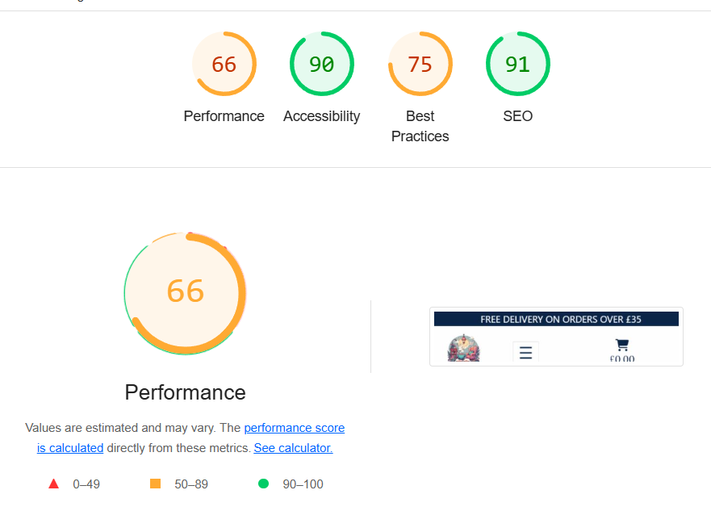

# Testing Contents
* [**Testing Contents**](<#testing-contents>)
  * [Validator Testing](<#validator-testing>)
    * [HTML](<#html>)
    * [CSS](<#css>)
    * [Python and Django](<#python-and-django>)
    * [JavaScript](<#javascript>)
  * [Lighthouse](<#lighthouse>)
  * [Browser Compatibility](<#browser-compatibility>)
  * [Manual Testing](<#manual-testing>)
  * [User Story Testing](<#user-story-testing>)
  * [Additional Testing](<#additional-testing>)
    * [Wave](<#wave>)
    * [Responsiveness Testing](<#responsiveness-testing>)
  * [Known Bugs](<#known-bugs>)
    * [Unresolved Bugs](<#unresolved-bugs>)

# Validator Testing

## HTML

The [HTML W3C Validator] was used to validate all HTML files. The results are as follows:
|**Filename**|**Image**|**Pass/Fail**|
|------------|---------|-------------|
|index.html||Pass|
|products.html||Pass|
|product_detail.html||Pass|
|all_genres.html||Pass|
|all_categories.html||Pass|
|product_management.html||Pass|
|edit_book.html||[Edit Book Page](documentation/screenshots/validation/edit-book-html.png)|Fail|
|edit_accessory.html|[Edit Accessory Page](documentation/screenshots/validation/edit-accessory-html.png)|Fail|
|about.html||Pass|
|contact.html||Pass|
|contact_success.html||Pass|
|faqs.html|||
|partners.html||Pass|
|privacy_policy.html||Pass|
|forum.html||Pass|
|post_list.html|[Full Thread Page](documentation/screenshots/validation/post-list-html.png)|Pass|
|edit_thread.html||Pass|
|edit_post.html||Pass|
|bag.html||Pass|
|checkout.html||Pass|
|checkout_success.html||Pass|
|profile.html|||
|downloads.html||Pass|

[Back To Top](<#testing-contents>)

## CSS
The [W3C CSS Validator](https://jigsaw.w3.org/css-validator/) was used to validate all css file. The results are below:

|**Filename**|**Image**|**Pass/Fail**|
|------------|---------|-------------|
|base.css||Pass|
|forum.css||Pass|
|profiles.css||Pass|

[Back To Top](<#testing-contents>)

## Python and Django
The CI Python Linter Validator was used to validate all python files which I created or edited. I corrected mistakes as I went with the VS Code Problems tab.

  | **App**     |   **Models**  |   **Urls**  |   **views**  |**Bag Tools**  | **Contexts**  | **Pass/Fail**  |
  |-------------|---------------|-------------|--------------|---------------|---------------|---------------|
  | **bag**     |||||| All Pass  |

  | **App**     |   **Urls**  |   **Views**  |   **Settings** |  **Pass/Fail** |
  |-------------|-------------|--------------|----------------|----------------|
  | **booknook**|||| All Pass  |

  | **App**|   **Admin**  |   **Forms**  |   **Models**  |   **Signals**  | **Urls**   | **Views**  | **Webhook Handler**  | **Webhooks** | **Pass/Fail**  |
  |--------|--------------|--------------|---------------|----------------|------------|------------|----------------------|---------|-----------|
  | **checkout**   ||||||||| All Pass |

  | **App**     |   **Admin**  |   **Forms**  |   **Models**  | **Urls**   | **Views**  | **Pass/Fail**  |
  |-------------|--------------|--------------|---------------|------------|------------|----------------|
  | **forum**   |||||| All Pass  |

  | **App**     |   **Admin**  |   **Forms**  |   **Models**  | **Urls**   | **Views**  | **Pass/Fail**  |
  |-------------|--------------|--------------|---------------|------------|------------|----------------|
  | **home**    |||||| All Pass  |

  | **App**     |   **Admin**  |   **Forms**  |   **Models**  | **Urls**   | **views**  | **Pass/Fail**  |
  |-------------|--------------|--------------|---------------|------------|------------|----------------|
  | **info**    |||||| All Pass  |

  | **App**     |   **Admin**  |   **Forms**  |   **Models**  | **Urls**   | **Views**  | **Widgets** | **Pass/Fail**  |
  |-------------|--------------|--------------|---------------|------------|------------|-------------|----------------|
  | **products**||||||| All Pass  |

  | **App**     |   **Admin**  | **Apps**|   **Forms**  | **Models**  | **Signals** | **Urls**   | **Views**  | **Pass/Fail**  |
  |-------------|--------------|---------|--------------|-------------|-------------|------------|------------|----------------|
  | **profiles**|||||||| All Pass  |

  | **App**     |   **Admin**  |   **Forms**  | **Models**  | **Urls**   | **Views**  | **Pass/Fail**  |
  |-------------|--------------|--------------|-------------|------------|------------|----------------|
  | **wishlist**|||||| All Pass  |

  Root Level Python Files

  |**Filename**              | **Image**                   | **Pass/Fail** |
  |--------------------------|-----------------------------|---------------|
  |Create Products From Books|| Pass|
  |Custom Storages|| Pass|
  |Download Images||Pass|
  |Update product||Pass|

[Back To Top](<#testing-contents>)
  
## JavaScript

  [JS Hint]() was used to validate JavaScript code.

  |**Page**     |**Image**         | **Pass/Fail** |
  |-------------|------------------|---------------|
  |all_categories.html||Pass|
  |all_genres.html||Pass|
  |bag.html||Pass|
  |countryfield.js||Pass|
  |edit_accessory.html||Pass|
  |edit_book.html||Pass|
  |forum.html||Pass|
  |post_list.html||Pass|
  |product_detail.html||Pass|
  |product_management.html||Pass|
  |products.html||Pass|
  |profile.html||Pass|
  |quantity_input_script.html||Pass|
  |stripe_elements.js|| Pass|
  |wishlist_modal_script.html|

[Back To Top](<#testing-contents>)

# Lighthouse testing

|**Page**|**Desktop**|**Mobile**|
|--------|-----------|----------|
|Homepage|||
|All Products Page|||
|All Genres Page|||
|All Categories Page|||
|Product Detail Page|||
|Edit Book Page|||
|Edit Accessory Page|||
|Product Management Page|||
|About Us Page|||
|Contact Us Page|||
|Contact Sucess Page|||
|FAQs|||
|Privacy Policy|||
|Partners Page|||
|Forum|||
|Post List Page|)||
|Profile Page|||
|Bag|||
|Checkout Page|||
|Checkout Success|||
|Login|||
|Logout|||
|Register|||
|Forgot Password|||
|Change Password||

On Chrome when auditing the 'Checkout' page for mobile - message appeared stating I should try in incognit mode. The results are below.

Checkout Mobile - Incognito Mode

Best Practices should be higher, however it is lower due to the presence of third party cookies due to Stripe.

[Back To Top](<#testing-contents>)

# Browser Compatibility

[Back To Top](<#testing-contents>)

# Manual Testing
## Home Page

|**User Action**|**Expected Result**|**Pass/Fail**|**Comments**|
|---------------|-------------------|-------------|------------|

## All Products Page

|**User Action**|**Expected Result**|**Pass/Fail**|**Comments**|
|---------------|-------------------|-------------|------------|

## By Genre Page (All Genres)

|**User Action**|**Expected Result**|**Pass/Fail**|**Comments**|
|---------------|-------------------|-------------|------------|

## By Category Page (All Categories)

|**User Action**|**Expected Result**|**Pass/Fail**|**Comments**|
|---------------|-------------------|-------------|------------|

## Product Detail

|**User Action**|**Expected Result**|**Pass/Fail**|**Comments**|
|---------------|-------------------|-------------|------------|

## Edit Book Page

|**User Action**|**Expected Result**|**Pass/Fail**|**Comments**|
|---------------|-------------------|-------------|------------|

## Edit Accessory Page

|**User Action**|**Expected Result**|**Pass/Fail**|**Comments**|
|---------------|-------------------|-------------|------------|

## Search

|**User Action**|**Expected Result**|**Pass/Fail**|**Comments**|
|---------------|-------------------|-------------|------------|

## About Us Page

|**User Action**|**Expected Result**|**Pass/Fail**|**Comments**|
|---------------|-------------------|-------------|------------|

## Contact Us Page

|**User Action**|**Expected Result**|**Pass/Fail**|**Comments**|
|---------------|-------------------|-------------|------------|

## Contact Us Success Page

|**User Action**|**Expected Result**|**Pass/Fail**|**Comments**|
|---------------|-------------------|-------------|------------|

## FAQs Page

|**User Action**|**Expected Result**|**Pass/Fail**|**Comments**|
|---------------|-------------------|-------------|------------|

## Privacy Policy Page

|**User Action**|**Expected Result**|**Pass/Fail**|**Comments**|
|---------------|-------------------|-------------|------------|

## Partners Page

|**User Action**|**Expected Result**|**Pass/Fail**|**Comments**|
|---------------|-------------------|-------------|------------|

## Forum

|**User Action**|**Expected Result**|**Pass/Fail**|**Comments**|
|---------------|-------------------|-------------|------------|

## Post List Page

|**User Action**|**Expected Result**|**Pass/Fail**|**Comments**|
|---------------|-------------------|-------------|------------|

## Profile Page

|**User Action**|**Expected Result**|**Pass/Fail**|**Comments**|
|---------------|-------------------|-------------|------------|

## Bag

|**User Action**|**Expected Result**|**Pass/Fail**|**Comments**|
|---------------|-------------------|-------------|------------|

## Checkout Page

|**User Action**|**Expected Result**|**Pass/Fail**|**Comments**|
|---------------|-------------------|-------------|------------|

## Checkout Success Page

|**User Action**|**Expected Result**|**Pass/Fail**|**Comments**|
|---------------|-------------------|-------------|------------|

## Login

|**User Action**|**Expected Result**|**Pass/Fail**|**Comments**|
|---------------|-------------------|-------------|------------|

## Logout

|**User Action**|**Expected Result**|**Pass/Fail**|**Comments**|
|---------------|-------------------|-------------|------------|

## Register

|**User Action**|**Expected Result**|**Pass/Fail**|**Comments**|
|---------------|-------------------|-------------|------------|

## Forgot Password

|**User Action**|**Expected Result**|**Pass/Fail**|**Comments**|
|---------------|-------------------|-------------|------------|

[Back To Top](<#testing-contents>)

# User Story Testing

## BookNook Planning and Design

|**User Story**|**Acceptance Criteria**|**Testing Method**|**Pass/Fail**|**Comments**|
|--------------|-----------------------|------------------|-------------|------------|
|Create epics and user stories|Create epic and story templates|Verify templates are created|Pass||
||Add epics to project board|Check project board for epics|Pass||
||Assign stories to epics|Verify stories are assigned to epics|Pass||
|Create wireframes|Plan comprehensive design|Review wireframes|Pass||
||Clear reference for coding|Verify wireframes are clear and usable|Pass||
|Design ERD|Use LucidChart to plan database|Check ERD in LucidChart|Pass||
||Display relationships accurately|Verify relationships in ERD|Pass||
||Include tables, keys, relationships|Review ERD|Pass||
|Write Business Plan|Include condept, mission, vision|Review business plan in README|Pass||
||Analyze target market|Verify market analysis in README|Pass||
||Detail marketing strategy|Check marketing strategy in README|Pass||
||Include future development|Verify business model and future features sections in README|Pass||

[Back To Top](<#testing-contents>)

## Viewing and Navigation

|**User Story**|**Acceptance Criteria**|**Testing Method**|**Pass/Fail**|**Comments**|
|--------------|-----------------------|------------------|-------------|------------|
|Browsing products|View list of products|Navigate to products page|Pass|
||List displayed clearly|Verify product list clarity|Pass|
||Click to individual page|Navigate to product page|Pass|
|Create product detail|View individual product page|Navigate to product detail|Pass||
||Accurate and clear details|Verify product details|Pass||
||Display extra information|Check for add to wishlist/save for later|Pass||
|Create purchases total|Display running total|Add items to bag to check total|Pass||
||Update in real time|Verify rela time updates|Pass||

[Back To Top](<#testing-contents>)

## Registration and User Accounts

|**User Story**|**Acceptance Criteria**|**Testing Method**|**Pass/Fail**|**Comments**|
|--------------|-----------------------|------------------|-------------|------------|
|Account registration|Display registration button|Check visibility of button|Pass||
||Register with email/password|Test registration process|Pass||
||Receive confirmation email|Verify email receipt|Pass||
|Account login/logout|Display login/logout buttons|Check visibility of buttons|Pass||
||Simple but secure process|Test login/logout functionality|Pass||
||Access profile after login|Verify profile access|Pass||
|Password recovery|Visible 'forgot password' button|Check visibility of button|Pass||
||Receive instructions|Test password recovery process|Pass||
||Simple but secure process|Verify recovery functionality|Pass||

[Back To Top](<#testing-contents>)

## User Engagement

|**User Story**|**Acceptance Criteria**|**Testing Method**|**Pass/Fail**|**Comments**|
|--------------|-----------------------|------------------|-------------|------------|
|Leaving reviews|Leave reviews for purchased products|Test review submission|Pass||
||Include rating and text|Verify review from fields|Pass||
||Show success message|Check for success notification|Pass||
||Save reviews to database|Verify database entry|Pass||
|Viewing reviews|Display reviews on product page|Navigate to product page|Pass||
||Sort reviews by recent|Verify sorting functionality|Pass||
|Update/Delete reviews|Edit or delete reviews|Test edit/delete review|Pass||
||Reflect changes in real-time|Verify real-time updates|Pass||

[Back To Top](<#testing-contents>)

## Shopping Bag and Save for Later

# Additional Testing
## Wave
## Responsive Testing

# Bugs

## Fixed Bugs

## Unresolved Bugs

