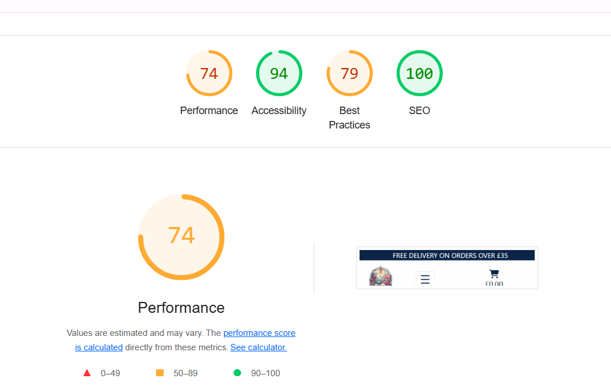
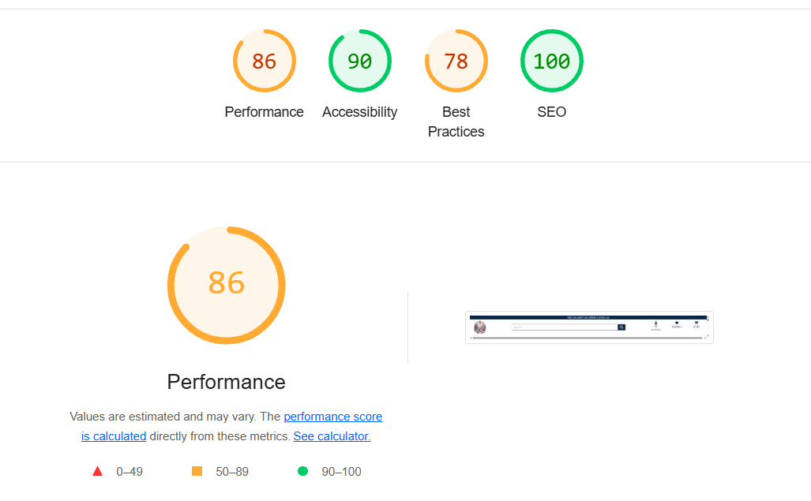

# Testing Contents
* [**Testing Contents**](<#testing-contents>)
  * [Validator Testing](<#validator-testing>)
    * [HTML](<#html>)
    * [CSS](<#css>)
    * [Python and Django](<#python-and-django>)
    * [JavaScript](<#javascript>)
  * [Lighthouse](<#lighthouse>)
  * [Manual Testing](<#manual-testing>)
  * [User Story Testing](<#user-story-testing>)
  * [Known Bugs](<#known-bugs>)
    * [Unresolved Bugs](<#unresolved-bugs>)

# Validator Testing

## HTML

The [HTML W3C Validator] was used to validate all HTML files. The results are as follows:
|**Filename**|**Image**|**Pass/Fail**|**Comments**|
|------------|---------|-------------|------------|
|index.html||Pass||
|products.html||Pass||
|product_detail.html||Pass||
|all_genres.html||Pass||
|all_categories.html||Pass||
|product_management.html||Pass||
|edit_book.html||Fail|The errors shown in the validator come from html in the Django form itself. I have tried to fix these errors but unfortunately have not been able to yet.|
|edit_accessory.html||Fail|The errors shown in the validator come from html in the Django form itself. I have tried to fix these errors but unfortunately have not been able to yet.|
|about.html||Pass||
|contact.html||Pass||
|contact_success.html||Pass||
|faqs.html||Pass||
|partners.html||Pass||
|privacy_policy.html||Pass||
|forum.html||Pass||
|post_list.html||Pass||
|edit_thread.html||Pass||
|edit_post.html||Pass||
|bag.html||Pass||
|checkout.html||Pass||
|checkout_success.html||Pass||
|profile.html||Fail|I have scoured my code trying to find unclosed divs but could not find any. I checked to see if anything was misaligned but once again couldn't find anything. I used a [closing tag checker](https://www.aliciaramirez.com/closing-tags-checker/) which initially showed my of an unclosed 
 tag but once corrected it said there were no unclosed elements. !(documentation/screenshots/validation/profile-html-checker.png)|
|downloads.html||Pass||

In the future, I plan to find solutions for all the errors, however at this point I have not been able to.

[Back To Top](<#testing-contents>)

## CSS
The [W3C CSS Validator](https://jigsaw.w3.org/css-validator/) was used to validate all css file. The results are below:

|**Filename**|**Image**|**Pass/Fail**|
|------------|---------|-------------|
|base.css||Pass|
|forum.css||Pass|
|profiles.css||Pass|

[Back To Top](<#testing-contents>)

## Python and Django
The CI Python Linter Validator was used to validate all python files which I created or edited. I corrected mistakes as I went with the VS Code Problems tab.

  | **App**     |   **Models**  |   **Urls**  |   **views**  |**Bag Tools**  | **Contexts**  | **Pass/Fail**  |
  |-------------|---------------|-------------|--------------|---------------|---------------|---------------|
  | **bag**     |||||| All Pass  |

  | **App**     |   **Urls**  |   **Views**  |   **Settings** |  **Pass/Fail** |
  |-------------|-------------|--------------|----------------|----------------|
  | **booknook**|||| All Pass  |

  | **App**|   **Admin**  |   **Forms**  |   **Models**  |   **Signals**  | **Urls**   | **Views**  | **Webhook Handler**  | **Webhooks** | **Pass/Fail**  |
  |--------|--------------|--------------|---------------|----------------|------------|------------|----------------------|---------|-----------|
  | **checkout**   ||||||||| All Pass |

  | **App**     |   **Admin**  |   **Forms**  |   **Models**  | **Urls**   | **Views**  | **Pass/Fail**  |
  |-------------|--------------|--------------|---------------|------------|------------|----------------|
  | **forum**   |||||| All Pass  |

  | **App**     |   **Admin**  |   **Forms**  |   **Models**  | **Urls**   | **Views**  | **Pass/Fail**  |
  |-------------|--------------|--------------|---------------|------------|------------|----------------|
  | **home**    |||||| All Pass  |

  | **App**     |   **Admin**  |   **Forms**  |   **Models**  | **Urls**   | **views**  | **Pass/Fail**  |
  |-------------|--------------|--------------|---------------|------------|------------|----------------|
  | **info**    |||||| All Pass  |

  | **App**     |   **Admin**  |   **Forms**  |   **Models**  | **Urls**   | **Views**  | **Widgets** | **Pass/Fail**  |
  |-------------|--------------|--------------|---------------|------------|------------|-------------|----------------|
  | **products**||||||| All Pass  |

  | **App**     |   **Admin**  | **Apps**|   **Forms**  | **Models**  | **Signals** | **Urls**   | **Views**  | **Pass/Fail**  |
  |-------------|--------------|---------|--------------|-------------|-------------|------------|------------|----------------|
  | **profiles**|||||||| All Pass  |

  | **App**     |   **Admin**  |   **Forms**  | **Models**  | **Urls**   | **Views**  | **Pass/Fail**  |
  |-------------|--------------|--------------|-------------|------------|------------|----------------|
  | **wishlist**|||||| All Pass  |

  Root Level Python Files

  |**Filename**              | **Image**                   | **Pass/Fail** |
  |--------------------------|-----------------------------|---------------|
  |Create Products From Books|| Pass|
  |Custom Storages|| Pass|
  |Download Images||Pass|
  |Update product||Pass|

[Back To Top](<#testing-contents>)
  
## JavaScript

  [JS Hint]() was used to validate JavaScript code.

  |**Page**     |**Image**         | **Pass/Fail** |
  |-------------|------------------|---------------|
  |all_categories.html||Pass|
  |all_genres.html||Pass|
  |bag.html||Pass|
  |countryfield.js||Pass|
  |edit_accessory.html||Pass|
  |edit_book.html||Pass|
  |forum.html||Pass|
  |post_list.html||Pass|
  |product_detail.html||Pass|
  |product_management.html||Pass|
  |products.html||Pass|
  |profile.html||Pass|
  |quantity_input_script.html||Pass|
  |stripe_elements.js|| Pass|
  |wishlist_modal_script.html|

[Back To Top](<#testing-contents>)

# Lighthouse testing

|**Page**|**Desktop**|**Mobile**|
|--------|-----------|----------|
|Homepage|||
|All Products Page|||
|All Genres Page|||
|All Categories Page|||
|Product Detail Page|||
|Edit Book Page|||
|Edit Accessory Page|||
|Product Management Page|||
|About Us Page|||
|Contact Us Page|||
|Contact Sucess Page|||
|FAQs|||
|Privacy Policy|||
|Partners Page|||
|Forum|||
|Post List Page|)||
|Profile Page|||
|Bag|||
|Checkout Page|||
|Checkout Success|||
|Login|||
|Logout|||
|Register|||
|Forgot Password|||
|Change Password||

On Chrome when auditing the 'Checkout' page for mobile - message appeared stating I should try in incognit mode. The results are below.

Checkout Mobile - Incognito Mode

Best Practices should be higher, however it is lower due to the presence of third party cookies due to Stripe.

[Back To Top](<#testing-contents>)

# Manual Testing
## Home Page

|**User Action**|**Expected Result**|**Pass/Fail**|**Comments**|
|---------------|-------------------|-------------|------------|
|Click on logo|Redirects to Home page|Pass||
|Click on shop now button|Redirects to Products page|Pass|
|Fill in newsletter sign up with valid information|Displays success message and email confirmation received|Pass||
|Fill in newsletter sign up with invalid information|Displays error message|Pass||

[Back To Top](<#testing-contents>)

## Navigation Bar

|**User Action**|**Expected Result**|**Pass/Fail**|**Comments**|
|---------------|-------------------|-------------|------------|
|Click on All Products link in navbar/off canvas menu|Redirects to Products page|Pass||
|Click on By Price in navbar|Redirects to Products page|Pass|Shows products from low to high|Pass||
|Click on By Rating in navbar|Redirects to Products page|Pass|Shows products from high to low|Pass||
|Click on All Books link in navbar/off canvas menu|Redirects to Books page|Pass||
|Click on By Price in navbar|Redirects to Books page|Pass|Shows products from low to high|Pass||
|Click on By Rating in navbar|Redirects to Books page|Pass|Shows products from high to low|Pass||
|Click on By Genre in navbar/off canvas menu|Redirects to Book Genres page|Pass||
|Click on All Accessories link in navbar/off canvas menu|Redirects to Accessories page|Pass||
|Click on By Price in navbar|Redirects to Accessories page|Pass|Shows products from low to high|
|Click on By Rating in navbar|Redirects to Accessories page|Pass|Shows products from high to low|
|Click on By Category in navbar/off canvas menu|Redirects to Accessory Categories page|Pass||
|Click on Partners in navbar/off canvas menu|Redirects to Partners page|Pass||
|Click on Forum in navbar/off canvas menu|Redirects to Forum page|Pass||
|Click on About Us in navbar/off canvas menu|Redirects to About Us page|Pass||
|Click on Contact Us in navbar/off canvas menu|Redirects to Contact Us page|Pass||
|Guest user clicks on Account in navbar|Shows Login/Register buttons|Pass||
|Guest user clicks on Login in navbar|Redirects to Login|Pass||
|Guest user clicks on Register in navbar|Redirects to Register|Pass||
|Logged in user clicks on "Account"/Hi username in navbar|Shows Profile/Log out buttons|Pass||
|Logged in user clicks on Profile in navbar/off canvas menu|redirects to Profile|Pass||
|Logged in user clicks on Sign out in navbar/off canvas menu|redirects to Sign out page|Pass||
|Logged in user clicks on Wishlists in navbar/off canvas menu|Redirects to wishlist section on profile|Pass||
|Click on Bag|Redirects user to Bag page|Pass||
|Logged in staff clicks on "Account"/Hi username in navbar|Shows Product Management/Profile/Log out buttons|Pass||
|Query search bar|Shows products which match query|Pass||
|Search bar empty when querying|Displays error message|Pass||
|Search doesn't match any product|Displays error message|Pass||

[Back To Top](<#testing-contents>)

## All Products Page

|**User Action**|**Expected Result**|**Pass/Fail**|**Comments**|
|---------------|-------------------|-------------|------------|
|Click on Browse by Accessory Category|Displays category buttons|Pass||
|Click on Browse by Book Genre|Displays genre buttons|Pass||
|Click on sort by filter|sorts by rating (high to low, vice versa), by price(high to low, vice versa), by name (A to Z, vice versa)|Pass||
|Click on product|Redirects to product detail page|Pass||
|Click on scroll to top arrow|Scrolls to top|Pass||
|Click on pagination buttons|Takes user to selected page or next/previous page|Pass||

[Back To Top](<#testing-contents>)

## By Genre Page (All Genres) / By Category Page (All Categories)

|**User Action**|**Expected Result**|**Pass/Fail**|**Comments**|
|---------------|-------------------|-------------|------------|
|Click on sort by filter|sorts by rating (high to low, vice versa), by price(high to low, vice versa), by name (A to Z, vice versa)|Pass||
|Click on product|Redirects to product detail page|Pass||
|Click on scroll to top arrow|Scrolls to top|Pass||
|Click on pagination buttons|Takes user to selected page or next/previous page|Pass||
|Click on left/right arrows with categories/genres|Products move left/right|Pass||

[Back To Top](<#testing-contents>)

## Product Detail

|**User Action**|**Expected Result**|**Pass/Fail**|**Comments**|
|---------------|-------------------|-------------|------------|
|Click Add to bag|Displays success message/Shows bag with item in/Bag icon changes colour and shows grand total|Pass||
|Click Add to Wishlist|Modal opens for user to choose a wishlist or create a new one|Pass||
|Click Add to Wishlist in modal|Adds to wishlist/Success message shown/pink heart shown on top left corner of product image|Pass||
|Click Remove from wishlist|Success message shown/Pink heart disappears from image|Pass||
|Click Save for Later|Adds Save for later/Success message shown/redirects to bag/saved section|Pass||
|Staff clicks Edit|Redirects to edit page, book or accessory depending on product|Pass||
|Staff clicks Delete|Modal opens confirming deletion|Pass||
|Staff clicks Delete in modal|Item is deleted|Pass||
|Scroll to review form|Only displays form to users who have purchased said item|Pass||
|Submit review with valid input|Success message/ user sees review waiting for approval|Pass||
|Click Edit on review|Review content prefills form|Pass||
|Submit edited review|Displays success message/ review is updated|Pass|
|Click Delete on review|Modal opens confirming deletion|Pass||
|Click Delete in modal|Review is deleted|Pass||
|Click + quantity button|Quantity increases until 99|Pass||
|Click - quantity button|Quantity decreases until 1|Pass||

[Back To Top](<#testing-contents>)

## Edit Book Page / Edit Accessory Page

|**User Action**|**Expected Result**|**Pass/Fail**|**Comments**|
|---------------|-------------------|-------------|------------|
|Navigate to Edit Book/Accessory page|Info message displays name of product being edited|Pass||
|Click Select Image|Staff computer image file opens|Pass||
|Invalid input entered|Error message displayed|Pass||
|Valid input entered|Succes message displayed/Redirected to product detail|Pass||

[Back To Top](<#testing-contents>)

## About Us Page

|**User Action**|**Expected Result**|**Pass/Fail**|**Comments**|
|---------------|-------------------|-------------|------------|
|Click Shop button|Redirected to Products page|Pass||
|Click Forum button|Redirected to Forum page|Pass||

[Back To Top](<#testing-contents>)

## Contact Us Page

|**User Action**|**Expected Result**|**Pass/Fail**|**Comments**|
|---------------|-------------------|-------------|------------|
|Enters invalid input|Error message shown|Pass||
|Enters valid input|Success message shown/ redirects to Success page|Pass||

[Back To Top](<#testing-contents>)

## Contact Us Success Page

|**User Action**|**Expected Result**|**Pass/Fail**|**Comments**|
|---------------|-------------------|-------------|------------|
|Click Shop button|Redirected to Products page|Pass||
|Click Forum button|Redirected to Forum page|Pass||

[Back To Top](<#testing-contents>)

## FAQs Page

|**User Action**|**Expected Result**|**Pass/Fail**|**Comments**|
|---------------|-------------------|-------------|------------|
|Click FAQs link in footer|Redirects to FAQs page|Pass||
|Click questions|Opens answer below|Pass||
|Click Contact Us button|Redirected to Contact Us page|Pass||

[Back To Top](<#testing-contents>)

## Privacy Policy Page

|**User Action**|**Expected Result**|**Pass/Fail**|**Comments**|
|---------------|-------------------|-------------|------------|
|Click Privacy Policy link in footer|Redirects to privacy policy page|Pass||
|Click Email Address link|Opens email account|Pass||
|Click Contact link|Redirects to Contact Us page|Pass||

[Back To Top](<#testing-contents>)

## Partners Page

|**User Action**|**Expected Result**|**Pass/Fail**|**Comments**|
|---------------|-------------------|-------------|------------|
|Click Charity links|Opens links in new tab|Pass||
|Click Contact link|Redirects to Contact Us page|Pass||

[Back To Top](<#testing-contents>)

## Forum

|**User Action**|**Expected Result**|**Pass/Fail**|**Comments**|
|---------------|-------------------|-------------|------------|
|Click Category buttons|Opens corresponding category thread list|Pass||
|Staff clicks add category|Modal opens|Pass||
|Staff fills in name, description add submits|Success message is shown|Pass||
|Click Create New Thread|Modal opens|Pass||
|Invalid input entered|Fill in reminders shown/form cannot be submitted|Pass||
|Valid input entered|Form submitted/Success message shown/thread added to gategory|Pass||
|Click on thread title|Redirected to thread(post list) page|Pass||

[Back To Top](<#testing-contents>)

## Post List Page

|**User Action**|**Expected Result**|**Pass/Fail**|**Comments**|
|---------------|-------------------|-------------|------------|
|Click Reply button|Modal opens|Pass||
|Invalid input entered|Fill in reminders shown/form cannot be submitted|Pass||
|Valid input entered|Form submitted/Success message shown/post added to thread|Pass||
|Click Edit Post|Redirected to Edit Post page|Pass||
|Invalid input entered|Fill in reminders shown/form cannot be submitted|Pass||
|Valid input entered|Form submitted/Success message shown/post updated|Pass||
|Click Delete on Post|Modal opens confirming deletion|Pass||
|Click Delete in modal|Post is deleted|Pass||
|Click Edit Thread|Redirected to Edit Thread page|Pass||
|Invalid input entered|Fill in reminders shown/form cannot be submitted|Pass||
|Valid input entered|Form submitted/Success message shown/thread updated|Pass||
|Click Back to Forum|Redirected to Forum|Pass||
|Click Delete on Thread|Modal opens confirming deletion|Pass||
|Click Delete in modal|Thread is deleted|Pass||

[Back To Top](<#testing-contents>)

## Profile Page

|**User Action**|**Expected Result**|**Pass/Fail**|**Comments**|
|---------------|-------------------|-------------|------------|
|Click Delivery Details|Delivery Details section is shown|Pass||
|Click Update Delivery Details|Form is shown|Pass||
|Invalid input entered|Fill in reminders shown/form cannot be submitted|Pass||
|Valid input entered|Form submitted/Success message shown/details updated|Pass||
|Click Personal Bio|Personal Bio section is shown|Pass||
|Click Update Personal Bio|Form is shown|Pass||
|Invalid input entered|Fill in reminders shown/form cannot be submitted|Pass||
|Valid input entered|Form submitted/Success message shown/bio updated|Pass||
|Click Order History|Past orders shown|Pass||
|Click Order Number|Redirected to Order Confirmation Page|Pass||
|Click My Reviews |Reviews shown|Pass||
|Click Edit Review|Form shown above|Pass||
|Invalid input entered|Fill in reminders shown/form cannot be submitted|Pass||
|Valid input entered|Form submitted/Success message shown/review updated|Pass||
|Click Delete|Modal opens confirming deletion|Pass||
|Click Delete in modal|Review is deleted|Pass||
|Click Review Product|Redirects to product page|Pass||
|Click My Wishlists|Wishlists shown|Pass||
|Click Remove|Modal opens|Pass||
|Click Delete in modal|Wishlist item is deleted|Pass||
|Click Delete Wishlist|Modal opens|Pass||
|Click Delete in modal|Entire Wishlist is deleted|Pass||
|Click My Saved Items |Saved Items shown|Pass||
|Click + quantity button|Quantity increases until 99|Pass||
|Click - quantity button|Quantity decreases until 1|Pass||
|Click Move To Bag|Redirects to bag|Pass||
|Click Remove|Modal opens|Pass||
|Click Delete in modal|Saved item is deleted|Pass||
|Click Forum Interaction |Forum Interaction shown|Pass||
|Click Threads Button|Threads shown|Pass|
|Click Edit Thread|Redirects to Edit Thread page|Pass||
|Invalid input entered|Fill in reminders shown/form cannot be submitted|Pass||
|Valid input entered|Form submitted/Success message shown/thread updated|Pass||
|Click Delete on Thread|Modal opens confirming deletion|Pass||
|Click Delete in modal|Thread is deleted|Pass||
|Click Edit Post|Redirects to Edit Post page|Pass||
|Invalid input entered|Fill in reminders shown/form cannot be submitted|Pass||
|Valid input entered|Form submitted/Success message shown/post updated|Pass||
|Click Delete on Post|Modal opens confirming deletion|Pass||
|Click Delete in modal|Post is deleted|Pass||
|Click Got to Forum|Redirects to Forum|Pass||
|Click Rewards and Benefits |Rewards and Benefits section shown|Pass||
|Click Challenges| Redirects to Downloads Page|Pass||
|Click Newsletter |Newsletter section shown|Pass||
|Click Unsubscribe|Success message shown/User is unsubscribed|Pass||
|Invalid input entered|Fill in reminders shown/form cannot be submitted|Pass||
|Valid input entered|Form submitted/Success message shown/Subscribed|Pass||

[Back To Top](<#testing-contents>)

## Downloads

|**User Action**|**Expected Result**|**Pass/Fail**|**Comments**|
|---------------|-------------------|-------------|------------|
|Click PDF buttons|Opens in new tab|Pass||
|Click Back to Profile|Redirects to Profile|Pass||

[Back To Top](<#testing-contents>)

## Bag

|**User Action**|**Expected Result**|**Pass/Fail**|**Comments**|
|---------------|-------------------|-------------|------------|
|Alter quantity, click Update|Quantity updates|Pass||
|Click Remove|Item is removed from bag/success message|Pass||
|Click Save For later|Item moes to Saved for later|Pass||
|Click Secure Checkout|Redirects to Checkout page|Pass||
|Click Keep Shopping|Redirects to Products page|Pass||

[Back To Top](<#testing-contents>)

## Checkout Page

|**User Action**|**Expected Result**|**Pass/Fail**|**Comments**|
|---------------|-------------------|-------------|------------|
|Invalid input entered|Fill in reminders shown/form cannot be submitted|Pass||
|Valid input entered|Form submists/Redirects to Order Confirmation page|Pass||
|Click Adjust Bag|Redirects to Bag page|Pass||

[Back To Top](<#testing-contents>)

## Checkout Success Page

|**User Action**|**Expected Result**|**Pass/Fail**|**Comments**|
|---------------|-------------------|-------------|------------|
|Order completed|Success message shown/ Email is sent|Pass||
|Click Profile button|Rredirects to Profile|Pass||
|Click Our Shop button|Rredirects to Products page|Pass||
|Click Forum button|Rredirects to Forum|Pass||

[Back To Top](<#testing-contents>)

## Login

|**User Action**|**Expected Result**|**Pass/Fail**|**Comments**|
|---------------|-------------------|-------------|------------|
|Invalid input entered|Fill in reminders shown/form cannot be submitted|Pass||
|Valid input entered|Form submitted/Success message shown/user logged in|Pass||

[Back To Top](<#testing-contents>)

## Logout

|**User Action**|**Expected Result**|**Pass/Fail**|**Comments**|
|---------------|-------------------|-------------|------------|
|Click Confirm Logout button|Redirects to Home Page|Pass||

[Back To Top](<#testing-contents>)

## Register

|**User Action**|**Expected Result**|**Pass/Fail**|**Comments**|
|---------------|-------------------|-------------|------------|
|Click Register button under account in navbar|Redirects to Sign Up Page|Pass||	
|Enter valid email address|Field only accepts email address format|Pass||
|Invalid input entered|Fill in reminders shown/form cannot be submitted|Pass||
|Valid input entered|Form submitted/Success message shown/confirmation email sent|Pass||

[Back To Top](<#testing-contents>)

## Footer

|**User Action**|**Expected Result**|**Pass/Fail**|**Comments**|
|---------------|-------------------|-------------|------------|
|Click Contact Us|Redirects to Contact page|Pass||
|Click FAQs|Redirects to FAQs page|Pass||
|Click Twitter|Opens Twitter in new tab|Pass||
|Click Facebook|Opens BookNook Facebook page in new tab|Pass||
|Click Instagram|Opens BookNook Instagram page in new tab|Pass||
|Click TikTok|Opens TikTok in new tab|Pass||
|Click Privacy Policy|Redirects to Privacy Policy page|Pass||

[Back To Top](<#testing-contents>)

# User Story Testing

## BookNook Planning and Design

|**User Story**|**Acceptance Criteria**|**Testing Method**|**Pass/Fail**|**Comments**|
|--------------|-----------------------|------------------|-------------|------------|
|Create epics and user stories|Create epic and story templates|Verify templates are created|Pass||
||Add epics to project board|Check project board for epics|Pass||
||Assign stories to epics|Verify stories are assigned to epics|Pass||
|Create wireframes|Plan comprehensive design|Review wireframes|Pass||
||Clear reference for coding|Verify wireframes are clear and usable|Pass||
|Design ERD|Use LucidChart to plan database|Check ERD in LucidChart|Pass||
||Display relationships accurately|Verify relationships in ERD|Pass||
||Include tables, keys, relationships|Review ERD|Pass||
|Write Business Plan|Include condept, mission, vision|Review business plan in README|Pass||
||Analyze target market|Verify market analysis in README|Pass||
||Detail marketing strategy|Check marketing strategy in README|Pass||
||Include future development|Verify business model and future features sections in README|Pass||

[Back To Top](<#testing-contents>)

## Viewing and Navigation

|**User Story**|**Acceptance Criteria**|**Testing Method**|**Pass/Fail**|**Comments**|
|--------------|-----------------------|------------------|-------------|------------|
|Browsing products|View list of products|Navigate to products page|Pass|
||List displayed clearly|Verify product list clarity|Pass|
||Click to individual page|Navigate to product page|Pass|
|Create product detail|View individual product page|Navigate to product detail|Pass||
||Accurate and clear details|Verify product details|Pass||
||Display extra information|Check for add to wishlist/save for later|Pass||
|Create purchases total|Display running total|Add items to bag to check total|Pass||
||Update in real time|Verify rela time updates|Pass||
|Add to wishlists - logged in user|'Add to wishlist' adds item|Check wishlist for added item|Pass||
||Only logged-in users can add items|Check product detail as guest|Pass||
|View wishlists|Accessible from navbar or profile|Check profile/Click navbar icon|Pass||
||Displays images/names/prices|Check wishlist view|Pass||
||'No item' message if empty|Check wishlist views|Fail|It was decided not to include this, as the wishlist visibly has no wishlist items in and instead has a delete wishlist button. If user no longer desires to keep said wishlist they can delete it.
||Items link to product page|Click item name|Pass||
|Deleting wishlist items|Able item deletion|Delete item|Pass|
||Confirmation message appears|Check message|Pass||
||Instant view update|Check view|Pass||
|Deleting wishlists|Able wishlist deletion|
||Confirmation message appears|Check message|Pass||
||Instant view update|Check view|Pass||

[Back To Top](<#testing-contents>)

## Registration and User Accounts

|**User Story**|**Acceptance Criteria**|**Testing Method**|**Pass/Fail**|**Comments**|
|--------------|-----------------------|------------------|-------------|------------|
|Account registration|Display registration button|Check visibility of button|Pass||
||Register with email/password|Test registration process|Pass||
||Receive confirmation email|Verify email receipt|Pass||
|Account login/logout|Display login/logout buttons|Check visibility of buttons|Pass||
||Simple but secure process|Test login/logout functionality|Pass||
||Access profile after login|Verify profile access|Pass||
|Password recovery|Visible 'forgot password' button|Check visibility of button|Pass||
||Receive instructions|Test password recovery process|Pass||
||Simple but secure process|Verify recovery functionality|Pass||
|Create user profile|Able to view profile|Click account icon|Pass||
||Displays all information|View profile page|Pass||
||Has CRUD functionality|Check all content on profile page|Pass||

[Back To Top](<#testing-contents>)

## User Engagement

|**User Story**|**Acceptance Criteria**|**Testing Method**|**Pass/Fail**|**Comments**|
|--------------|-----------------------|------------------|-------------|------------|
|Leaving reviews|Leave reviews for purchased products|Test review submission|Pass||
||Include rating and text|Verify review from fields|Pass||
||Show success message|Check for success notification|Pass||
||Save reviews to database|Verify database entry|Pass||
|Viewing reviews|Display reviews on product page|Navigate to product page|Pass||
||Sort reviews by recent|Verify sorting functionality|Pass||
|Update/Delete reviews|Edit or delete reviews|Test edit/delete review|Pass||
||Reflect changes in real-time|Verify real-time updates|Pass||
|Newsletter signup|Form on profile/home page|Check respective pages|Pass||
||Has name/username fields|Check forms|Pass||
||Has 'submit' button|Check forms|Pass||
||Invalid input displays error message|Enter invalid input|Pass||
||Success message upon valid submission|Enter valid input|Pass||
||Confirmation email reception|Check junk folder|Pass||
||Unsubscription on profile and email|Attempt on profile and by email|Pass/Fail|Users can unsubscribe from the profile, however I haven't been able to get the email link to work as of yet||

[Back To Top](<#testing-contents>)

## Shopping Bag and Save for Later

|**User Story**|**Acceptance Criteria**|**Testing Method**|**Pass/Fail**|**Comments**|
|--------------|-----------------------|------------------|-------------|------------|
|View shopping bag|Add, update, remove items|Test shopping bag functionality|Pass||
||Display total priceVerify total price display|Pass||
|View saved items|Access saved items section|Navigate to saved items|Pass||
||Display name, image, price|Verify item details|Pass|| 
|Save items for later|Save items from product page/bag|Test save functionality|Pass||
||Show confirmation message|Check for notification|Pass||
||Store items in accounts|Verify item storage|Pass||
|Move saved items to bag|Move items with single click|Test 'move' functionality|Pass||
||Show confirmation message|Check for notification|Pass||
||Item no longer in 'Saved'|Verify item absence|Pass||
|Remove saved items |Delete items from saved list|Test remove functionality|Pass||
||Show confirmation message|Check for notification|Pass||
||Deleted from saved items|Verify item deletion|Pass||

[Back To Top](<#testing-contents>)

# Checkout

|**User Story**|**Acceptance Criteria**|**Testing Method**|**Pass/Fail**|**Comments**|
|--------------|-----------------------|------------------|-------------|------------|
|Proceed to checkout|Enter payment details|Test checkout process|Pass||
||Confirm order and provide number|Verify order confirmation|Pass||
|Order confirmation page display|Redirect to confirmation page|Test redirection|Pass||
||Display order details|Verify order details|Pass||
|Order confirmation email|Confirmation email reception|Verify email receipt|Pass||
||Include order details|Check email content|Pass||

[Back To Top](<#testing-contents>)

# User Profile

|**User Story**|**Acceptance Criteria**|**Testing Method**|**Pass/Fail**|**Comments**|
|--------------|-----------------------|------------------|-------------|------------|
|Update delivery details|Update phone, address, etc.|Test update functionality|	Pass||
||Save and display correctly|	Verify saved details|Pass||
|Update personal bio|Update bio and favorite books|Test update functionality|Pass||
||Save and display correctly|Verify saved details|Pass||
|Rewards and benefits|View rewards and benefits|Navigate to rewards section|Pass||
||Display relevant details|Verify reward details|Pass||
|Editing threads|'Edit thread' button under each thread|Verify button visibility|Pass||
||Upon click, user redirected thread page with prefilled form|Test redirection and prefilled content|Pass||
||After submission, user redirected to forum section|Verify updated content in profile|Pass||
|Deleting threads|'Delete' under each thread|Verify button visibility|Pass||
||Upon click, confirmation modal appears|Test modal functionality|Pass||
|Viewing thread list|Thread titles are clickable links|Verify link|Pass||
||User redirected to post list upon click|Test redirection|Pass||

[Back To Top](<#testing-contents>)

# Forum

|**User Story**|**Acceptance Criteria**|**Testing Method**|**Pass/Fail**|**Comments**|
|--------------|-----------------------|------------------|-------------|------------|
|View forum categories|List all categories|Navigate to forum|Pass||
||Display name and description|Verify category details|Pass||
|View threads in a category|View threads in selected category|Navigate forum|Pass||
||Display title, creator, date|Verify thread details|Pass||
|Create a new thread|Access "Create New Thread" button|Test button functionality|Pass||
||Enter title and content|Verify form fields|Pass||
||Submit form to create thread|Test submission process|Pass||
||Display new thread in category|Verify thread appearance|Pass||
|Posts in threads|View posts in thread|Navigate to thread page|Pass||
|Display content, creator, date|Verify post details|Pass||
|Reply to thread|Access 'reply' button|Verify button visibility|Pass||
||Can enter reply|Test reply form|Pass||
||Can submit form|Test form submission|Pass||
||Reply appears in thread|Verify reply visible|Pass||

[Back To Top](<#testing-contents>)

# Administration and Moderation

|**User Story**|**Acceptance Criteria**|**Testing Method**|**Pass/Fail**|**Comments**|
|--------------|-----------------------|------------------|-------------|------------|
|Add products to store|Access user-friendly interface|Test interface usability|Pass||
||Separate forms by product type|Verify form fields|Pass||
||Display added product to users/admin|Check product visibility|Pass||
|Editing products|Display 'Edit' buttons to staff|Verify button visibility|Pass||
||Redirect to edit interface|Test redirection|Pass||
||Pre-fill current product details|Verify form fields|Pass||
||Correspond fields to product type|Check field accuracy|Pass||
|Deleting products|Display 'Delete' buttons|Verify button visibility|Pass||
||Show confirmation modal|Test modal functionality|Pass||
||Remove product from store|Verify product removal|Pass||

[Back To Top](<#testing-contents>)

# Website Informational Pages

|**User Story**|**Acceptance Criteria**|**Testing Method**|**Pass/Fail**|**Comments**|
|--------------|-----------------------|------------------|-------------|------------|
|Send enquiry|Accessible contact form|Navigate to contact page|Pass||
||Include name, email, message fields|Verify form fields|Pass||
|Display validation error|Test error handling|Pass||
|View BookNook's contact information|Display phone number and email|Verify contact details|Pass||
|Enquiry confirmation|Redirect to success page|Test redirection|Pass||
||Display thank you message|Verify success message|Pass||
||Inform user of message receipt|Check notification|Pass||
||Provide link to products/forum|Verify link functionality|Pass||
|View about us page|Include company history|Navigate to about us page|Pass||
||Include mission and values|Verify content|Pass||
||Well-organized and easy to read|Check readability|Pass||
|View privacy policy|Include comprehensive policy|Navigate to privacy policy|Pass||
||Clear, concise, easy to understand|Verify content clarity|Pass||
||Cover data collection, usage, sharing, rights|Check policy completeness|Pass||
|Contact company about privacy|Provide contact information|Verify contact details|Pass||
||Easily accessible and prominently displayed|Check visibility|Pass||

[Back To Top](<#testing-contents>)

# Website Informational Pages

|**User Story**|**Acceptance Criteria**|**Testing Method**|**Pass/Fail**|**Comments**|
|--------------|-----------------------|------------------|-------------|------------|
|Create and manage social media presence|BookNook Facebook page created|Verify Facebook page creation|Pass||
||BookNook's logo as profile picture|Check profile picture|Pass||
||Regular posts uploaded|Verify content|Pass?Fail|This is a future feature and was intended as an ongoing plan|
||Comments and messages are monitored and responded to|Test message responses|Pass/Fail|This is a future feature and was intended as an ongoing plan|

[Back To Top](<#testing-contents>)

# Bugs
## Fixed Bugs
During the 'Added checkout logic, order summary and loading overlay' commit. I realised there was a typo in my .gitignore file and my env.py file had been puched to GitHub. I had accidentally written .env.py. i subsequently deleted the env.py from the repository. I also created a new .gitignore file as the previous was corrupted. I then typed the following command:

  `git filter-branch --index-filter "git rm -rf --cached --ignore-unmatch env.py" HEAD`

I followed the steps in [daily dev tips](https://dev.to/dailydevtips1/removing-a-env-file-from-git-history-3gao).

On the products page, when items were being sorted by name, there were first being sorted by product type then by name. This was an issue as I already had respective pages to see books and accessories by theirselves. The bug came from the view file, where I had sorted products by name. I removed this code, then the products mixed and sorted by name not by product then name.

Email confirmations were not being sent. I went through all corresponding checkout code but couldn't find where the issue was. After a very long time of searching for the issue, I saw on slack that others had had this same problem. I had to update my allauth and Django to version 4.2. After this the problem was fixed.

The Order History section on the profile was not responsive on mobile. I added new html to show on smaller screen sizes and left the original for larger screen sizes.

Users who had pruchased items could leave as many reviews as they wanted on the same product. I changed the relationship to One to One. This does mean that if a customer were to buy the same product more than once, they would not be able to leave another review. I don't see this as a bug because I intend it to be that way until BookNook becomes more popular and I can see there is a need to chnage it.

On the weekend I tried adding new products to the store through the Heroku deployed site. I had never had any problems through the production site. I kept getting Integrity Error as the reason as to why I couldn't add any products. I searched everywhere for the solution and was about to follow some code about entering PostgreSQL and changing the Max Id of products to where it should be. The problem was that every time I tried to add a product, it would try to give the new product a low id, which I knew was already taken. I tried a couple more times, then I realised that with every Integrity Error I got, the id got higher. I proceeded to do this 100 more times until the id was at max value and I could add new products to the store.

[Back To Top](<#testing-contents>)

## Unresolved Bugs
I set up newsletter signup emails through my code which work perfectly, however the 'Unsubscribe' link in the email does not work. I tried a coupl of different ways but could not get it working in time.

Adding product to wishlist, or save for later shows the add to bag toast. I had hoped to troubleshoot this and fix it however I had to prioritise the most important components to get done first and I ran out of time. I will solve it in the future.

Whilst asking family to test my project, my mum signed up for the wishlist for the first time, but an error message showed up saying that email was already signed up(which it wasn't), this however did get logged to the backend as a new newsletter signup. I tried to recreate this scenario, however I never got that error message again. I checked my code and didn't see there the issue was. Also I am not sure whether this is a bug or if that was a glitch. 

I just found another bug in my code, I have written about it in the existing features section, in the Saved Items section of the profile: Unfortunately, at the time of writing this I have just seen a slight bug and it is too late to change this. The functionality is there, however the '+' and '-' buttons serve as sort of enter keys. So a user can enter a number with a keyboard or use the arrows inside of input rectangle and save it by pressing the plus or minus button. Aside from that a user can remove and Shared Item by pressing the remove button.

[Back To Top](<#testing-contents>)

